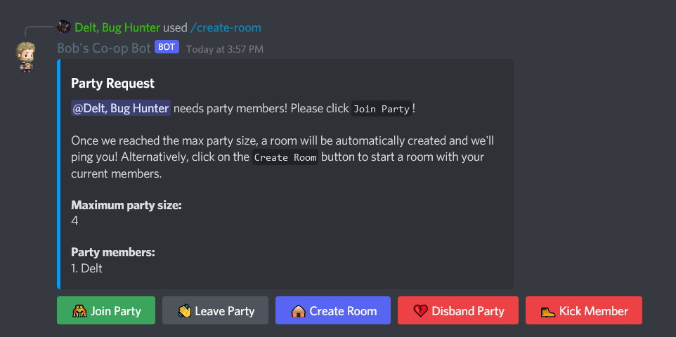

# Co-op Bot

A co-op bot that sets up chat rooms for players of the `Guardian Tales` game to chat and arrange co-op matches.

## Getting started

Setup a discord application/bot by following Step 1 [here](https://www.digitalocean.com/community/tutorials/how-to-build-a-discord-bot-with-node-js).

Copy `.env.template` and name it `.env`, replace the relevant data in there with your application credentials.

Invite your bot to a server with this link, replace `${DISCORD_CLIENT_ID}` with the client ID (AKA Application ID), which can be obtained when you created your discord application.

```text
https://discord.com/api/oauth2/authorize?client_id=${DISCORD_CLIENT_ID}&permissions=2048&scope=bot%20applications.commands

https://discord.com/api/oauth2/authorize?client_id=${DISCORD_CLIENT_ID}&permissions=292057778176&scope=bot%20applications.commands
```

> Developer Tip 💡
>
> The url has `permissions=292057778176`, which means it asks for the below permissions for the bot:
>
> - Send Messages
> - Send Messages in Threads
> - Manage Threads

Run the following commands in this project:

```bash
npm install
npm start
```

Use the bot by typing in `/`, and then clicking on the bot to see what commands are available.


